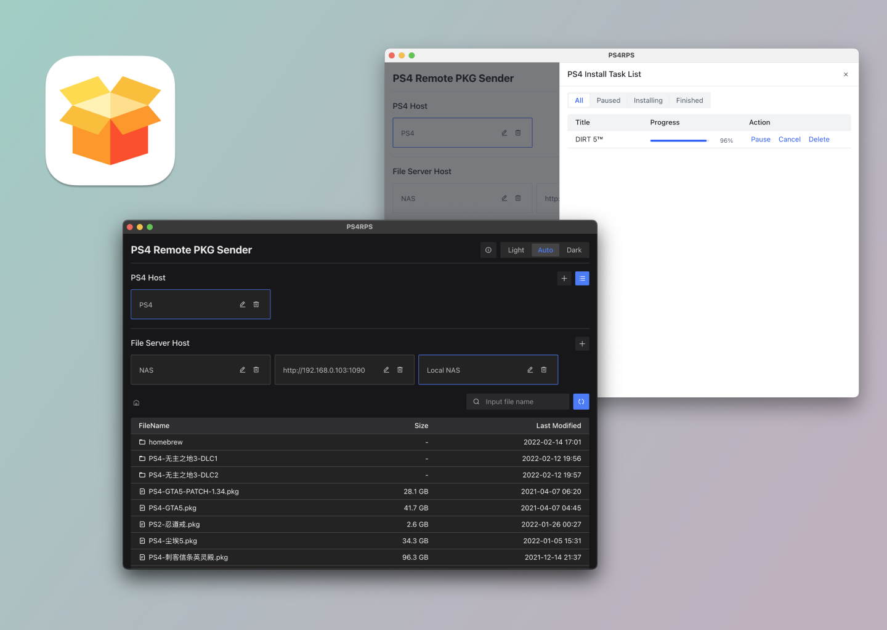

# PS4RPS

Use WebDAV as a remote pkg sender for PS4



## Features

- Support MacOS, Windows and Linux
- Dark Mode
- Pause and resume install task
- Use remote WebDAV Server to send install task
- Create WebDAV Server from local folder
- Multiple PS4 host and WebDAV host config

## Usage

1. Download this app from release page
2. Open the app
3. Add PS4 host (Your PS4 ip and port, The port is usually 12800), for example: 192.168.0.11:12800
4. Add WebDAV host
   1. Directory: use local folder to create WebDAV Server
   2. URL: use WebDAV Server url and password
5. Click pkg name from file list to send install task

**PS** Before send install task, you need install [remote pkg installer](https://gist.github.com/flatz/60956f2bf1351a563f625357a45cd9c8) on your PS4 and open

## Dev

```bash
pnpm install
pnpm run all:dev
pnpm run desktop:start
```

## Build

```bash
pnpm install
pnpm run all:build
pnpm run desktop:dist
```

## FAQ

1. Is there a web version of this tool?

Of course, if you do not need to create a WebDAV server from local is possible to use the web version directly, but because of this [cors bug](https://github.com/flatz/ps4_remote_pkg_installer/issues/10), the web version is currently not available

## TODO

- [ ] Auto find PS4 host
- [ ] Fix the [cors bug](https://github.com/flatz/ps4_remote_pkg_installer/issues/10) and release the web version
- [ ] Show more pkg file content, such as icon and titleID
